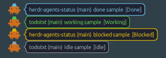

# herdr-agents-status

Always-on-top transparent overlay showing [Herdr](https://herdr.dev) agent status.

Spiritual successor to [claudeye](https://github.com/maedana/claudeye), built for Herdr instead of tmux.



Agents waiting for you (`Blocked`) or finished (`Done`) hop up and down, so they stand out at a glance.
Rows are ordered like Herdr's `priority` agent panel — `Blocked`, `Done`, `Working`, then `Idle` — and idle agents are dimmed.

## Install

```bash
herdr plugin install maedana/herdr-agents-status
```

### From source

```bash
git clone https://github.com/maedana/herdr-agents-status
cd herdr-agents-status
cargo build --release
herdr plugin link .
```

## Usage

```bash
herdr plugin action invoke toggle --plugin maedana.agents-status
```

Running the command again toggles the overlay off.

### Keybinding (recommended)

Add to `~/.config/herdr/config.toml`:

```toml
[[keys.command]]
key = "prefix+o"
type = "shell"
command = "herdr plugin action invoke toggle --plugin maedana.agents-status"
description = "agents status overlay"
```

## Configuration

Create `~/.config/herdr/plugins/config/maedana.agents-status/config.toml`:

```toml
position = "top-right"
sessions = "all"
```

### `position`

- `top-left`, `top-center` (default), `top-right`
- `middle-left`, `middle-center`, `middle-right`
- `bottom-left`, `bottom-center`, `bottom-right`

### `sessions`

Which Herdr sessions to show agents from:

- `all` (default) — every running session, merged into one list
- `current` — only the session the overlay was launched from
